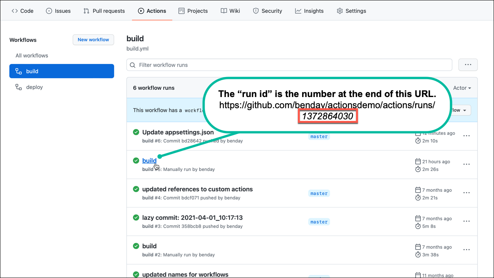

# Download specific artifact from a github workflow

This action helps you to download a specific version of an artifact from another github workflow.  Each execution of a GitHub Actions pipeline is assigned a run id.  Unfortunately, the run id is not shown in the user interface but it's available in the URL for the Actions run. 



The action downloads the artifact from the supplied run id.  

NOTE: if you simply want to download the latest artifact, use the [Download Latest Artifact action](https://github.com/marketplace/actions/download-latest-artifact-from-a-github-workflow) instead.

## Usage

To download an artifact from a workflow:  
```yaml
- name: download workflow artifact
  uses: benday-inc/download-artifact@main
  with:
     token: ${{ secrets.TOKEN_WITH_PERMISSIONS }}'
     repository_owner: 'benday'
     repository_name: 'actionsdemo'
     workflow_name: 'my-workflow'
     run_id: '4321235'
     download_path: '${{ github.workspace }}/temp'
     download_filename: 'actionsdemo-artifact.zip'
```

----
## Action Spec:

### Environment variables
- None

### Inputs
- `token` - github token for the target repository
- `repository_owner` - name of the repository account owner
- `repository_name` - name of the repository
- `workflow_name` - name of the workflow that created the artifact
- `run_id` - id of the pipeline run that you want to download an artifact from
- `download_path` - location on the agent to download the artifact to.
- `download_filename` - download the artifact file as this filename

### Outputs
- None
