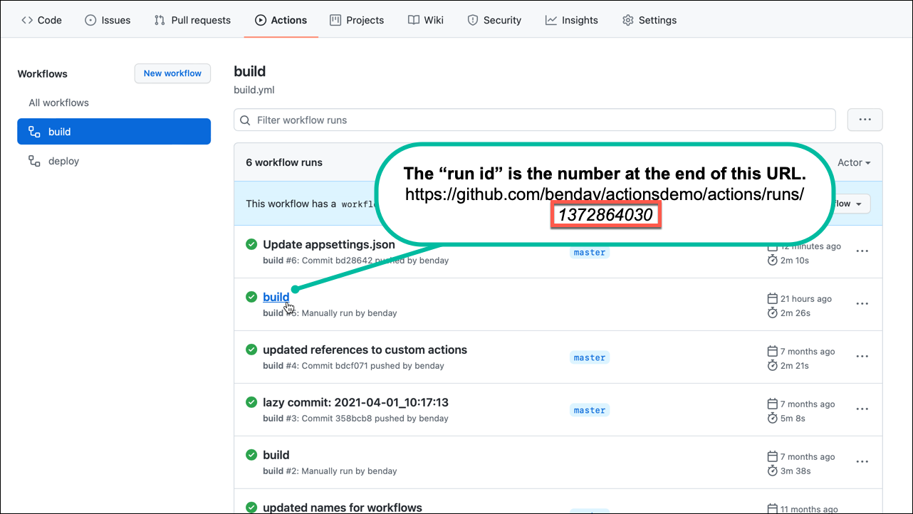

# Download specific artifact from a github workflow

Written by Benjamin Day  
Pluralsight Author | Microsoft MVP | Scrum.org Professional Scrum Trainer  
https://www.benday.com  
https://www.honestcheetah.com  
info@benday.com  
YouTube: https://www.youtube.com/@_benday  

*Got ideas for GitHub Actions you'd like to see? Found a bug? Let us know by submitting an issue https://github.com/benday-inc/download-artifact/issues. Want to contribute? Submit a pull request.*

This action helps you to download a specific version of an artifact from another github workflow.  Each execution of a GitHub Actions pipeline is assigned a run id.  Unfortunately, the run id is not shown in the user interface but it's available in the URL for the Actions run. 



The action downloads the artifact from the supplied run id.  

NOTE: if you simply want to download the latest artifact, use the [Download Latest Artifact action](https://github.com/marketplace/actions/download-latest-artifact-from-a-github-workflow) instead.

## What's new in v3

- Action now runs on **Node 24** (was Node 20). Self-hosted runners must have Node 24 available; GitHub-hosted runners are unaffected.
- Modernized dependencies: `@actions/core` 2.x, `axios` 1.x, `jest` 30, `prettier` 3, `eslint` 9 (flat config), `@typescript-eslint` 8.
- 0 npm vulnerabilities.

**Migration:** consumers should switch from `uses: benday-inc/download-artifact@v2` to `@v3`.

## Usage

To download an artifact from a workflow:  
```yaml
- name: download workflow artifact
  uses: benday-inc/download-artifact@v3
  with:
     token: ${{ secrets.TOKEN_WITH_PERMISSIONS }}
     repository_owner: 'benday'
     repository_name: 'actionsdemo'
     artifact_name: 'build-output'
     workflow_name: 'my-workflow'
     run_id: '4321235'
     download_path: '${{ github.workspace }}/temp'
     download_filename: 'actionsdemo-artifact.zip'
```

----
## Action Spec:

### Environment variables
- None

### Inputs
- `token` - github token for the target repository
- `repository_owner` - name of the repository account owner
- `repository_name` - name of the repository
- `workflow_name` - name of the workflow that created the artifact
- `artifact_name` - name of artifact to download
- `run_id` - id of the pipeline run that you want to download an artifact from
- `download_path` - location on the agent to download the artifact to.
- `download_filename` - download the artifact file as this filename

### Outputs
- None
